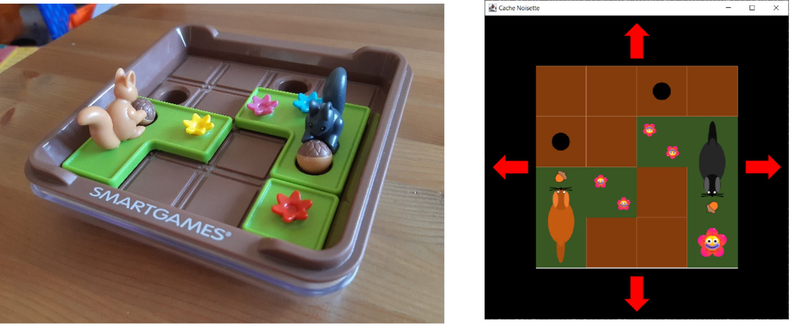
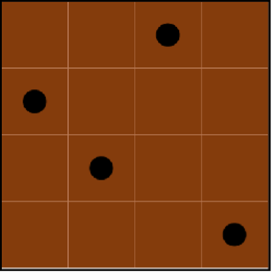
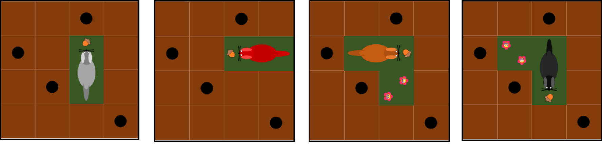

# Cache Noisettes Game


A Java Swing puzzle game developed for **SCC111 at Lancaster University**. The project combines a desktop interface, object-oriented game logic, and bitmap-based level loading.

Cache Noisettes roughly translates to *Hide the Nuts*. In this single-player puzzle, squirrels slide around a **4 × 4 board** to drop their nuts into holes.



## Features

- A graphical board with four squirrel colours, flower obstacles, and fixed holes.
- Click-to-select squirrels and on-screen directional movement buttons.
- Collision and board-boundary checks, automatic nut dropping, and a victory popup when every nut is collected.
- A level selection menu populated from the bundled bitmap files: level 1 and level 10.
- Restarting the active level and loading custom bitmap levels through a file picker.
- Image loading and rotation using the supplied `Picture` helper.

## Building and running

You need a **JDK 8 or newer** and a graphical desktop environment. The project uses Java's standard **Swing**, **AWT**, and **ImageIO** libraries, with no external dependencies or build tool.

From the repository root, compile and launch the game:

```sh
javac *.java
java Driver
```

Keep the repository root as the working directory so relative paths to `assets/` resolve correctly. In an IDE, open the folder as a Java project, select a JDK, and use `Driver.main()` as the entry point.

## How to play

1. Choose **Click to Play** to start level 1, or choose a level from **Select Level**.
2. Click a squirrel on the board to select it.
3. Use the arrow buttons below the board to move it one square at a time. Moves that overlap another piece or leave the board are rejected.
4. Move each Squirrel's head over an empty hole to drop its nut. Collect every Squirrel's nut to trigger the victory pop-up.
5. Use **Select Level → Restart Level** to reset the puzzle, or **Load Custom Level...** to open a compatible `.bmp` file.

## Game rules

- Each level starts with up to four squirrels and any flower obstacles on a 4 × 4 board. Four holes occupy fixed board spaces.
- Each Squirrel begins with a nut on the square occupied by its head. Grey and red squirrels occupy two squares; brown and black squirrels occupy three in an L shape.
- Squirrels slide horizontally or vertically without changing their starting orientation. They cannot overlap with other squirrels or flowers.
- Pieces can move over holes. When a squirrel carrying a nut moves its head over an empty hole, the nut drops into it.
- Each hole holds at most one nut, and deposited nuts cannot be removed. Place every nut into a hole to win.





## Level files

Levels are encoded as **15 × 15-pixel bitmap images**, with coloured cells indicating squirrel positions, orientations, and flowers. `FileManager` reads the bitmap bytes, and `LevelController` converts the pixel data into game pieces. The fixed holes are loaded from `assets/levels/blankWithHoles.bmp`.

Custom levels must follow the format of the supplied files, including their 24-bit BMP layout; arbitrary images are not supported. Files named `level<number>.bmp` in `assets/levels/` are discovered by the level menu when the application starts. Other compatible files can be opened through **Load Custom Level...**.

## Project structure

| Path | Purpose |
| --- | --- |
| `Driver.java` | Application entry point, main window setup, and controller connections. |
| `GameBoard.java` | Board display, piece selection and placement, and nut dropping. |
| `GamePiece.java` | Abstract base class defining the shared interface for board pieces. |
| `Squirrel.java` | Squirrel shapes, graphics, movement, collision checks, and carried nuts. |
| `Flower.java` | Flower obstacles that block movement. |
| `Hole.java` | Walkable holes and their stored nuts. |
| `Direction.java` | Direction values and associated image rotations. |
| `MovementButton.java` | Arrow buttons that move the selected Squirrel. |
| `LevelController.java` | Level loading, restarting, custom file selection, and win detection. |
| `MenuController.java` | Main menu, level selection menu, and popup windows. |
| `FileManager.java` | Reads the supplied bitmap format into a `BufferedImage`. |
| `Picture.java` | Supplied image loading and rotation helper. |
| `assets/icons/` | Squirrel, flower, hole, nut, and arrow graphics. |
| `assets/levels/` | Bundled bitmap levels and the fixed-hole board template. |
| `assets/readme/` | Illustrations used in this README. |

## Credits

The graphics and `Picture` helper were supplied with the SCC111 coursework materials through the course distribution repository:

```text
https://scc-source.lancs.ac.uk/scc.Y1/scc.111/cachenoisettes-dist.git
```

The game illustrations above come from the course's Part I Summer Project materials.
